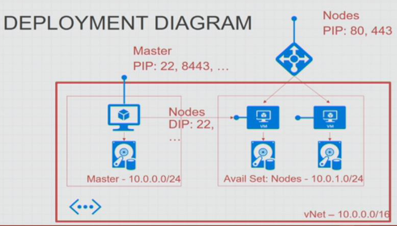

# Introduction

Following topics should be addressed by this workshop

1. how to deploy openshift on azure with a azure quickstart template.
2. some basic configuration options for openshift after deployment.
3. techlab / workshop on the basic features of openshift (deploy and scale apps).

# Deployment on Azure

how to deploy openshift on azure with azure-templates.

Deploy Openshift on azure with this template 
https://github.com/Azure/azure-quickstart-templates/tree/master/openshift-origin-rhel

## Linux Azure CLI

```sh
# generate a ssh key with ssh-keygen first if you dont have a ssh key already
azure group create <resource group> northeurope
azure keyvault create <key vault name> --resource-group <resource group> --location <azure location>
azure keyvault secret set -u <key vault name> -s <secret name> --file ~/.ssh/id_rsa
azure keyvault set-policy -u <key vault name> --enabled-for-template-deployment true
azure group deployment create --template-uri https://raw.githubusercontent.com/Azure/azure-quickstart-templates/master/openshift-origin-rhel/azuredeploy.json --parameters-file <parameter file> -m Incremental --nowait --subscription <subscription id> -d All <resource group> Microsoft.Template
```
as location you can use northeurope or any other location supported by azure.

## Alternatives

http://developers.redhat.com/blog/2016/10/11/four-creative-ways-to-create-an-openshiftkubernetes-dev-environment/

## Diagram



# Openshift

## Architectue

please visit

https://docs.openshift.org/latest/architecture/index.html .

and read in German

https://github.com/appuio/techlab/blob/lab-3.2/labs/01_quicktour.md


## Key Concepts

* Projects
 In Openshift a project is a kubernetes namespace with additional attributes. With a projects other resources are grouped.
 Openshift uses software defined network (SDN) to isolate projects from each other as much as possible.

* Container and Images
 Everything runs in a container. container are either build by source 2 image (S2I Build containers) or pulled from docker registry. Created container are pushed in a image registry to be later deployed and run. One container can consist of for example ubuntu + java + wildfly + application.

* Pods and Services
 A pod contains one or more container and is the unit managed (start, stop, restart, scale) by kubernetes at runtime.
 Within a projects a set of pods (replicated set) can be identified by services. each searvices can be exposed to the outside of openshift with routes.

### v2 <-> v3 comparison

| Version 2        | Version 3               |
|------------------|-------------------------|
| Namespace/Domain | Project                 |
| Gear             | Container               |
| Cartridge        | Docker Image (Template) |
| rhc              | oc                      |

## Workshop

1. Install the openshfit client tools 'oc' command line tool
  use this guide for the installation
  
  https://docs.openshift.org/latest/cli_reference/get_started_cli.html#installing-the-cli
  
  or use the appuio guide in German
  
  https://github.com/appuio/techlab/blob/lab-3.2/labs/02_cli.md
  
2. The fine folks from appuio provided a very good techlab workshop to go through the basics of openshift.
 complete the following workshop. maybe not all steps will work (specially the later onces).
 The techlab is completely in German
   
 https://github.com/appuio/techlab

## Configuration

### User

https://docs.openshift.org/latest/admin_guide/manage_users.html

## spring boot

Unfortunately spring boot is not a first citizen application type wihtin openshift. Most likely because they want to promote wildfly or other products. Due to the fact that openshift uses docker, it is extremly flexible in regards to what it can run.

With the following article you should be able to deploy any spring boot application to openshift.

https://blog.codecentric.de/en/2016/03/deploy-spring-boot-applications-openshift/

https://github.com/codecentric/springboot-sample-app

